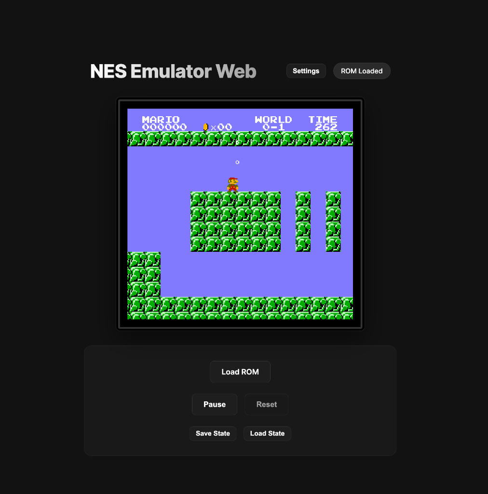

# NES Emulator Web

A modern, feature-rich NES emulator that runs directly in your browser. Built with React, TypeScript, and the jsnes core.



## ✨ Features

### 🎮 Core Emulation
- **Accurate NES Emulation** — Powered by jsnes, providing high compatibility with NES ROMs
- **60 FPS Gameplay** — Smooth frame-paced emulation with accurate timing
- **Full Audio Support** — Authentic NES sound with stereo output

### 💾 Save System
- **Save States** — Save your progress at any point and resume later
- **Load States** — Instantly restore your saved game state
- **Persistent Storage** — States saved to browser localStorage

### 🎛️ Controls
- **Fully Remappable Keys** — Customize every button to your preference
- **WASD + Arrow Key Support** — Dual control schemes out of the box
- **Keyboard Controls Persist** — Your custom mappings are saved between sessions

### 🔧 Developer & Debug Tools
- **Cheat System** — Enter raw memory address/value pairs for cheats
- **Frame-by-Frame Stepping** — Pause and advance one frame at a time
- **Pause & Resume** — Full playback control

### 🎨 Display Options
- **Adjustable Screen Size** — Scale from 1x to 3x native resolution
- **Multiple Color Themes** — Dark, Midnight, Retro Gray, Deep Purple, Matrix
- **Settings Persist** — Your preferences are remembered

## 🎹 Default Controls

| NES Button | Keyboard |
|------------|----------|
| D-Pad | `W` `A` `S` `D` or Arrow Keys |
| A Button | `J` |
| B Button | `K` |
| Start | `Enter` |
| Select | `Right Shift` |

## 🚀 Getting Started

### Prerequisites
- Node.js 18+
- npm or yarn

### Installation

```bash
# Clone the repository
git clone https://github.com/mariosumali/NES_Emulator.git
cd NES_Emulator

# Install dependencies
npm install

# Start development server
npm run dev
```

### Usage
1. Open the emulator in your browser
2. Click **Load ROM** and select a `.nes` file
3. Play!

## 🛠️ Tech Stack

- **React** — UI framework
- **TypeScript** — Type-safe development
- **Vite** — Fast build tooling
- **jsnes** — NES emulation core
- **Web Audio API** — Audio output

## 🗺️ Roadmap

Features commonly found in emulators that could be added:

- [ ] **Gamepad Support** — USB/Bluetooth controller support via Gamepad API
- [ ] **Player 2 Controls** — Second player keyboard bindings
- [ ] **Multiple Save Slots** — More than one save state
- [ ] **Fast Forward** — Speed up gameplay (2x, 4x)
- [ ] **Slow Motion** — Slow down for tricky sections
- [ ] **Rewind** — Go back in time during gameplay
- [ ] **Screen Recording** — Capture gameplay as GIF/video
- [ ] **Screenshot** — One-click screenshot saving
- [ ] **Game Genie Codes** — Support for Game Genie cheat format
- [ ] **ROM Database** — Auto-detect game titles and artwork
- [ ] **Fullscreen Mode** — Immersive fullscreen gameplay
- [ ] **CRT Filter** — Retro scanline/CRT shader effects
- [ ] **Touch Controls** — Mobile-friendly on-screen buttons
- [ ] **Netplay** — Online multiplayer via WebRTC

## 📄 License

MIT

---

Created by **Mario Sumali**